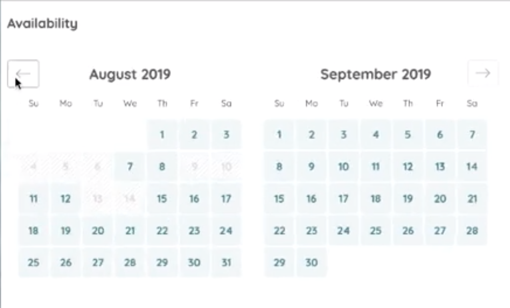
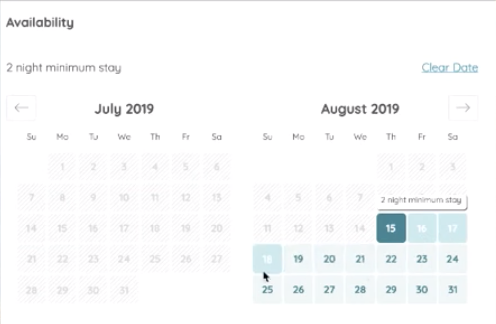
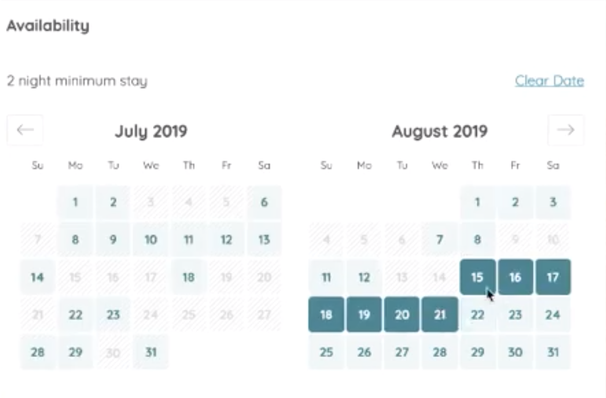

# Skybnb - Calendar Service Component

<h1 align="center"> Skybnb </h1> <br>
<p align="center">
  <a href="https://gitpoint.co/">
    
  </a>
</p>

<p align="center">
  Reservation Service Component, built with React
</p>


<!-- START doctoc generated TOC please keep comment here to allow auto update -->
<!-- DON'T EDIT THIS SECTION, INSTEAD RE-RUN doctoc TO UPDATE -->
## Table of Contents

- [Introduction](#introduction)
- [Features](#features)
- [Feedback](#feedback)
- [Contributors](#contributors)
- [Build Process](#build-process)
- [Backers](#backers-) *coming soon
- [Sponsors](#sponsors-) *coming soon
- [Acknowledgments](#acknowledgments) *coming soon

<!-- END doctoc generated TOC please keep comment here to allow auto update -->

## Introduction

Open Source, feature-rich calendar component made for making reservations and picking out dates. Made from scratch using React and some light back end using Node.js. 

## Features

A few of the things you can do with Skybnb:

* Accurate, stateful rendering of each component of the calendar
* Slide In and Slide Out Animation when prev/next buttons clicked, using [AntMotion](https://motion.ant.design/) library.
* Full functionality rendering of dates, accurate real-time and current months.
* RESTful API in place for inserting, reading, updating reservations to database (MongoDB)

<p align="center">
  
</p>
<p align="center">
  
</p>

<p align="center">
  
</p>

## Feedback

Feel free to send us feedback via [email](alerterb@gmail.com) or [file an issue](https://github.com/albthere/issues/new). New features requests are always welcome. If you wish to contribute, please take a quick look at the [guidelines](./CONTRIBUTING.md)!

# Contributors

This project follows the [all-contributors](https://github.com/albthere) specification.

## Build Process

- Follow the [React Guide](https://reactjs.org/docs/getting-started.html) for getting started building a web app project with React code. 

1. installs webpack bundle, when ran in root directory

```sh
npm install -g webpack
```

2. installs npm, ran in root directory
```sh
npm install
```

3. creates webpack bundle, output is in dist folder
```sh
npm run build
```

4. seed data to work with to simulate future reservations from db
```sh
npm run seed-data
```


5. runs node.js server to run app
```sh
npm run server-dev
```
